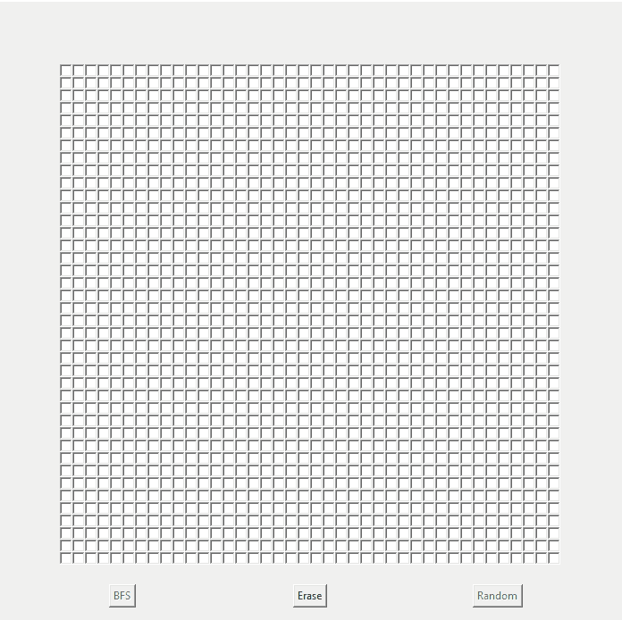

# BFS.py
Visualização do algoritimo de busca em largura em python.
É possível desenhar obstáculos como input ao algoritmo, tal como especificar a célula de início e fim.

###### Interface em Tkinter
